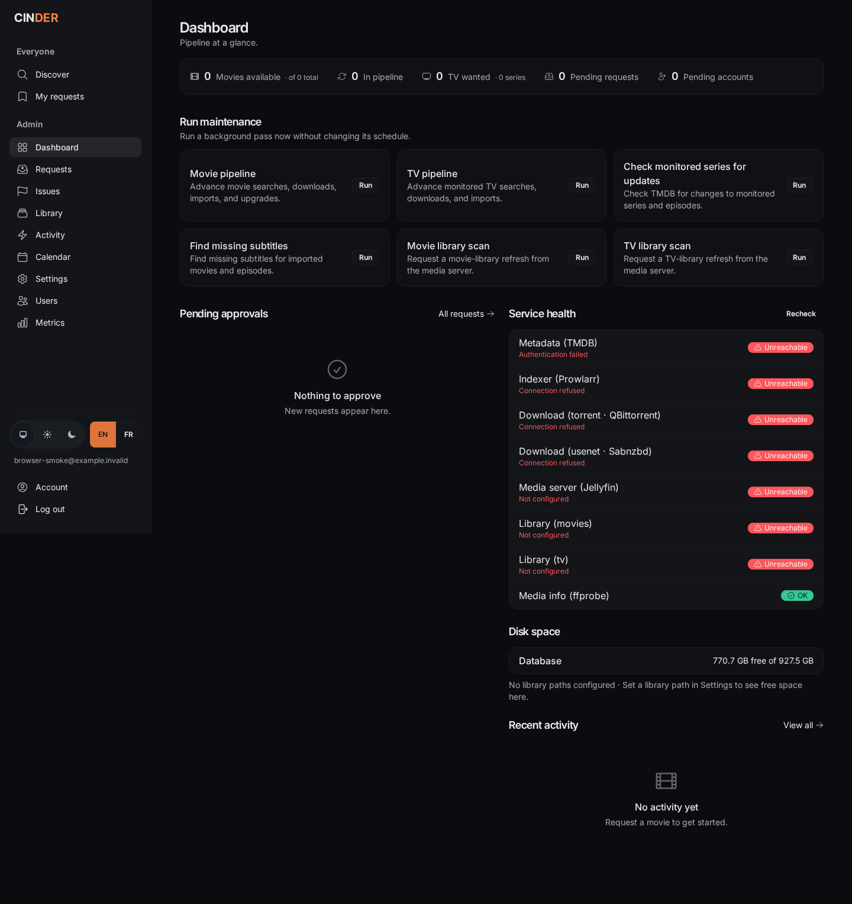
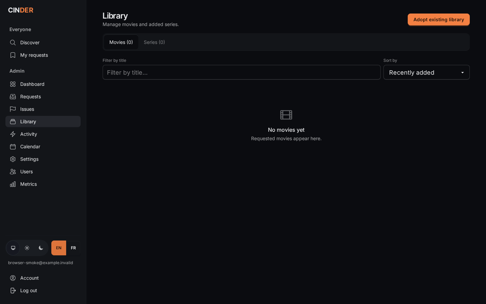

<p align="center">
  
</p>

<p align="center">
  <a href="https://github.com/simonbrunou/cinder/actions/workflows/ci.yml"></a>
  <a href="LICENSE"></a>
</p>

Cinder is a single-household, self-hosted replacement for the **Sonarr + Radarr + Seerr** loop
*and* the **Readarr + Bookshelf** loop: request a movie, TV show, e-book, or audiobook → find the
best release → download it → import it into **Jellyfin or Plex** (video) or **Booklore/
Audiobookshelf** (books). It's one Phoenix/LiveView app on SQLite — a single container, no
external database. Every external service (TMDB, Open Library/Hardcover, Prowlarr, the selected
torrent/Usenet client, Jellyfin/Plex, Audiobookshelf) sits behind a behaviour and is configured
in-app.

> **Status:** **v3.0** — movies + TV + multi-user (request → admin approval), admin-named
> movie/TV media profiles with opt-in per-title Anime handling, and e-book + audiobook request,
> acquisition, and library publication (replacing Readarr/Bookshelf) are built, validated live,
> and released. Build history in [`ROADMAP.md`](ROADMAP.md).

## Screenshots

### Admin dashboard



### Library



## Quickstart (Docker)

Requires Docker with the Compose plugin.

```sh
git clone https://github.com/simonbrunou/cinder.git
cd cinder
cp .env.example .env
echo "SECRET_KEY_BASE=$(openssl rand -base64 48)" >> .env   # or edit .env by hand
echo "CINDER_BOOTSTRAP_TOKEN=$(openssl rand -hex 32)" >> .env
mkdir -p media/{movies,tv,books,audiobooks,downloads} && sudo chown -R 65534:65534 media
docker compose up --build      # builds the image locally on first run
```

Cinder runs as `nobody` (uid 65534), so the bind-mounted `media/` directory must be owned by it —
otherwise the first-run wizard can't create the library roots and won't let you finish. (The
database volume is set up by the image itself.)

Open <http://localhost:4000>. Paste the `CINDER_BOOTSTRAP_TOKEN` from `.env` into the registration
form to claim the first admin, then remove both that `.env` value and its environment entry from
`docker-compose.yml`. The **first-run wizard** then collects your TMDB / indexer / download-client /
media-server / **library path** details (movies and TV are pre-filled from the compose file; type
in the e-book and audiobook folders, e.g. `/media/books` and `/media/audiobooks`, since only
boot-only config gets an env bootstrap — see [Configuration](#configuration)), validating each
before it lets you finish. Later household self-registration stays open and always creates a
normal user. A fresh instance without a bootstrap token fails closed: it cannot create the first
account.

Once a media server is configured with `PLEX_URL`/`PLEX_TOKEN` (or the equivalent `/settings`
fields), a **"Sign in with Plex"** button appears on the log-in page. Only Plex accounts with
access to that server (owner or shared user) may sign in; a Plex account Cinder has never seen
gets a new regular-user account, provided it carries an email address no Cinder user already
holds. A managed Plex Home account with no email, or one whose email collides with an existing
user, is refused rather than logged in — Cinder never logs into an existing account by email, only
by a linked Plex id. To attach Plex to an existing account (e.g. your admin), log in normally and
link it from Account settings, or import the account from `/users` before its first sign-in.

Jellyfin works the same way: configure `JELLYFIN_URL` (or the `/settings` field) and a **"Sign in
with Jellyfin"** username/password form appears on the log-in page, checked against your own
server's `Users/AuthenticateByName` — so only accounts that server already knows can sign in. The
same rule holds: a Jellyfin account Cinder has never seen gets a new regular-user account, never an
email-based login into an existing one, and linking Jellyfin to an existing account is an explicit
action from Account settings. Jellyfin exposes no email address, so a created account gets a
placeholder one you can change from Account settings. Emby speaks the same endpoint and should
work if you point the URL at one; it is untested.

> ⚠️ **Secure it before exposing it.** Keep the one-time bootstrap token private, and don't expose
> port 4000 to an untrusted network — run Cinder behind a reverse proxy (with TLS) or a VPN. See
> [`docs/operating.md`](docs/operating.md).

> 🔗 **Hardlinks.** Cinder hardlinks finished downloads into your library, so keep the library and
> your download client's completed-downloads directory on the **same filesystem**. Across
> filesystems (or on one that can't hardlink at all) the media file falls back to an atomic copy,
> which costs a second full copy of every import; loose subtitle sidecars fall back to copying too,
> and are logged and skipped only when placement still fails. The compose file keeps both under one
> `/media` mount — details in the operating guide.

## Configuration

Two tiers. A handful of **boot-only** keys stay environment variables; **service configuration**
is edited in-app at `/settings` (or the wizard) and stored in the database. DB
values **override** the env bootstrap, and clearing a setting reverts it to the env value/default.
Secrets are encrypted at rest with a key derived from `SECRET_KEY_BASE`.

### Boot-only environment variables

| Variable | Required | Default | Purpose |
|---|---|---|---|
| `SECRET_KEY_BASE` | **yes** | — | Signs sessions/cookies; also derives the at-rest encryption key and signing salts. Generate with `openssl rand -base64 48`. |
| `CINDER_BOOTSTRAP_TOKEN` | **first claim only** | — | One-time credential required while no account exists. Generate with `openssl rand -hex 32`, use it to create the first admin, then remove it from the deployment. |
| `DATABASE_PATH` | **yes** | — | Path to the SQLite database file (compose: `/data/cinder.db`). |
| `PHX_SERVER` | set `true` | — | Start the web server in the release. |
| `PHX_HOST` | no | `localhost` | Public hostname; used in generated URLs and to validate the LiveView WebSocket origin — set it to the hostname browsers actually use, or the live UI won't connect. |
| `PORT` | no | `4000` | HTTP listen port. |
| `POOL_SIZE` | no | `5` | SQLite connection-pool size. |
| `RELEASE_NAME` | auto | — | Set by the release; its presence triggers DB migrations on boot. |
| `CINDER_BASIC_AUTH_USER` / `CINDER_BASIC_AUTH_PASSWORD` | no | — | Set **both** to require HTTP Basic auth in front of every browser route and the `/api/v1` scope (`/healthz` and static assets stay open) — an optional outer gate while no admin exists yet, or a second layer when you can't front Cinder with a proxy/VPN. Unset ⇒ no gate. |

### In-app service configuration (set in the wizard / `/settings`)

| Group | Settings |
|---|---|
| TMDB | API read token (v4 bearer) |
| Indexer | Prowlarr URL + API key |
| Download | At most one torrent client (qBittorrent or Transmission) and one Usenet client (SABnzbd or NZBGet) — either protocol can be set to Disabled — credentials and per-client path mappings; optional completed-torrent ratio / seed-time cleanup limits |
| Media server | Jellyfin URL + API key **or** Plex URL + token + a per-library section (Movies, TV); media-server type; an optional **web URL** per server (see below) |
| Library paths | Required standard roots (`movies_library_path`, `tv_library_path`, `books_library_path`, `audiobooks_library_path`) plus admin-managed named movie/TV profiles at `/settings/profiles`; each profile chooses Standard or Anime handling and may set its own root, with a blank root falling back to the matching existing root. The two book roots have no env bootstrap (see below) — type them into the wizard or `/settings` directly |
| Release size bands | Per-kind min/max size (decimal GB), preferred resolutions and sources, preferred/blocked title terms, and an optional automatic-upgrade resolution cutoff. TV sizes are per episode (see below the table). Ships with defaults — movies 0.3–15 GB, TV 0.05–4 GB per episode; blank = default, an explicit `0` = no limit |
| Subtitles | OpenSubtitles API key + username + password, LibreTranslate URL + API key + batch size + request timeout (optional fallback translation), preferred subtitle languages (csv) — fetched automatically after each import and swept every 12 h; Cinder-downloaded sidecars are also checked serially by pinned, local CPU-only FFsubsync 0.5.1, with low-confidence/different-cut results left unchanged for review in Activity |
| Notifications | Discord webhook URL — posts an embed on availability and failures, on a request approval, and on the two things that need an admin: a new request awaiting approval and a new account awaiting activation (unset ⇒ nothing is posted to Discord). Plus **SMTP host / port / username / password / from address**: a requester-facing transport with its own event set, mailed to one person rather than to a household channel — their account activated, their request approved or denied, an issue they reported resolved, a movie or season available, a movie failed, and a search exhausted for episodes they wanted. It is not a mirror of the Discord channel: it carries no admin-facing new-request or new-account event, and Discord carries no account-activation notice. Sent only to a user with a confirmed email address who has left *"Email me when a request is approved or ready to watch"* on in Account settings. Plus a **generic webhook URL** + optional `Authorization` header value: every event Cinder emits POSTed as JSON (`{"event": "movie_available", …}`) to anything that speaks HTTP — ntfy, Gotify, Apprise, n8n, Home Assistant. There is no payload template; reshape it in the receiver. With no transport configured at all, events are log-only |
| Behaviour toggles | `auto_approve_all` (trusted households: every request grabs immediately), `move_on_import` (after a **Usenet** import, best-effort deletion of the source download; it never removes a torrent — the separate completed-torrent cleanup does that, and only once you set a ratio or seed-time limit, which is off by default), media-server type (Jellyfin/Plex) |
| Anime releases | Embedded-subtitle mode (allow/prefer/require), preferred/blocked release-group lists, preferred-group fallback delay (hours) — global, applies to every title switched to the Anime profile (audio mode is per-title — see the Audio picker below); `ffprobe_bin` (the `ffprobe` binary path/name used for post-download verification) |
| Metadata providers | Open Library (primary, no key required) plus an optional Hardcover API key (secondary, higher-precision identity resolution) — used to resolve a requested book/audiobook to a work, author, and edition |
| Migration source (Readarr/Bookshelf) | URL + API key + remote/local path prefixes for an existing Readarr-protocol-compatible Bookshelf instance, used only by the one-time `/library/adopt` cutover runbook (see [`docs/readarr-migration.md`](docs/readarr-migration.md)) |
| Audiobookshelf | URL + API key + library id — Cinder requests a library scan after every successful audiobook import; a failed scan retries automatically without re-downloading |

**TV size bands are per episode.** A release is banded against the still-wanted episodes it
covers, so one covering N of them is allowed N× the max. The upgrade sweep and manual search apply
that pack banding on the first pass; the automatic sweep re-bands a whole-season pack against the
season's full episode count only as a last-resort retry, when nothing else fit.

**Jellyfin/Plex web URL** is separate from the Jellyfin/Plex URL above on purpose. The latter is
how the Cinder *server* reaches your media server, which in the compose deployment is a
docker-internal address like `http://plex:32400` that a phone on your LAN cannot resolve. The web
URL is what a household member's *browser* should open (`https://app.plex.tv`, or your own public
Jellyfin address). Set it and an available title grows an **Open in Plex** / **Open in Jellyfin**
button; leave it blank and no button is shown. A background inventory matches Plex/Jellyfin items
to Cinder titles by exact TMDB id and deep-links matched titles; until a match exists, the button
keeps opening the server front door. Which server is used follows the configured media-server type,
so a stale URL or item id for the *other* server is never linked; with no type saved it falls back
to whichever URL is uniquely set, and with both set it shows nothing rather than guess.

Each can be **bootstrapped** from an environment variable (`TMDB_API_TOKEN`, `PROWLARR_URL`,
`MOVIES_LIBRARY_PATH`, `TV_LIBRARY_PATH`, `MOVIES_PLEX_SECTION`, `TV_PLEX_SECTION`,
`OPENSUBTITLES_API_KEY`, `LIBRETRANSLATE_URL`, `LIBRETRANSLATE_API_KEY`,
`LIBRETRANSLATE_BATCH_SIZE`, `LIBRETRANSLATE_TIMEOUT`, `SUBTITLE_LANGUAGES`, …) for an unattended first boot, but the in-app
value wins once set. Named profile roots, legacy Anime library destinations, the size bands, the
Anime release settings (including `ffprobe_bin`), and every book/audiobook setting (library
paths, metadata providers, the migration source, Audiobookshelf) have no env bootstrap — every
external service Cinder gained after the movies/TV core is configured directly in `/settings` or
the wizard, not through a new environment variable.

### Household API

Generate the single household key in `/settings` and send it as `x-api-key`. Treat it as an admin
credential: it can read and mutate the request queue. The optional HTTP Basic gate also applies.

- `GET /api/v1/status`
- `GET /api/v1/requests?limit=50&offset=0`
- `POST /api/v1/requests` with JSON `{"target_type":"movie","target_id":603}`,
  `{"target_type":"season","target_id":1399,"season_number":2}`, or
  `{"target_type":"book","target_id":42,"media_kind":"ebook"}` (`media_kind` is `ebook` or
  `audiobook`; required for a book request, since a work is monitored independently per kind).
  Optional fields are `requester_id`, `preferred_language` (`original`, `french`, `dual`, `any`,
  movies/TV only), and `media_profile` (`standard`, `anime`) or numeric `profile_id`. Do not send
  both profile fields. Without `requester_id`, Cinder attributes the request to the first active
  admin by id and it auto-approves; an active member id applies that member's quota and the
  normal approval gate.
- `POST /api/v1/requests/:id/approve` with optional JSON `{"profile_id":4}` (or legacy
  `{"media_profile":"anime"}`). Omitted profile uses the requester's proposal, then the oldest
  matching Standard profile.
- `POST /api/v1/requests/:id/deny` with JSON `{"reason":"Not for this household"}`.
- `DELETE /api/v1/requests/:id` deletes only the request row, never the catalog title.

Create returns `201`, approve/deny `200`, and delete `204`. Repeating approve/deny returns
`409 not_pending`; repeating delete returns `404 not_found`. Invalid JSON fields and values return
stable `4xx` JSON errors and are never converted to atoms.

## How it works

Four contexts mirror the pipeline: **Catalog** (TMDB discovery + movie/series requests), **Acquisition**
(Prowlarr search + release parsing/scoring), **Download** (qBittorrent/Transmission and
SABnzbd/NZBGet clients + a polling
GenServer), **Library** (hardlink + rename into the Jellyfin/Plex layout, then scan). Background
pollers advance each request through its state machine and broadcast over PubSub so the LiveView
dashboard updates live. A title's lifecycle state — a movie's status and an episode's derived
file/grab state — is written only inside the Catalog context, through transition choke-points whose
guarded form compare-and-sets against the status the caller last saw, which on SQLite WAL keeps a
web write racing the poller correct rather than flaky. Request, download-intent and import-stage
state each stay in their own context.

**TV** works the same way as movies for users: any authenticated user searches for a TV show and
**requests a season**; a non-admin's request is pending until an admin approves (or denies), and
an admin's own request auto-approves. The request→approval gate, per-user quotas, My-requests
view, and per-season state badges (Pending / Approved / Denied) all apply, in parity with movies.
Once approved, monitoring is set for that season only and the TV poller takes over: it searches
for the best release per still-wanted episode — preferring a season pack when one covers them,
falling back to per-episode grabs — then maps each file in a pack to its episode on import.
Admins can also manage monitoring directly from the series detail page. This includes Standard
Season 0 episodes: an aired special is searched only when an admin explicitly monitors it, and a
matching `S00Exx` file imports under `Season 00`. A periodic TMDB refresh
keeps season/episode data current (so a newly-aired or late-dated episode becomes search-eligible
on its own), and a `/calendar` view lists upcoming monitored episodes. Episodes land under the
selected TV destination in the `Show (Year) {tmdb-id}/Season NN/Show (Year) {tmdb-id} - SxxEyy.ext`
layout Jellyfin/Plex expect.

**Anime** is a per-title handling engine selected by a named movie/TV profile (`Auto` remains
available on existing titles: it searches as Standard, and retries through the Anime engine only
when a Standard search finds no match on a Japanese-animation title). An Anime
profile gets alias- and absolute/scene-number-aware release search (native,
romaji, and licensed titles; releases like `One Piece 1122v2` resolve without TMDB season math) and
searches Season 0 specials only when they're classified story-special/recap and monitored. A
downloaded batch only imports once every file is certainly mapped to one episode (one narrow
exception: a lone non-ignored file with no episode markers, against a lone reserved episode, is
inferred rather than held) — anything ambiguous holds the whole batch as **Needs mapping** on
`/activity` for review (**Retry import** after fixing the files, or **Discard**). Each title's
Audio pick (Original/French/French + original/Any — the same per-title picker movies and TV
already have) doubles as its Anime audio mode; global Anime preferences in `/settings` (subtitle
mode, preferred/blocked release groups) apply on top, and — if `ffprobe` is available — a
completed download's actual audio/subtitles are verified against them before import, rejecting
and blocklisting a release that provably violates the policy. `ffprobe` is optional but
recommended; without it, a title that requires no particular audio or embedded-subtitle language
still imports, while one that does is held after bounded retries — neither imported nor
blocklisted, since the requirement can't be proven either way. A held item surfaces as **Needs
verification** (the movie's detail page; `/activity` for a TV grab): install `ffprobe`, then click
**Retry verification**.

Named profiles at `/settings/profiles` can route movie and TV titles into separate roots. Leave a
profile root blank to keep using the matching existing Standard/Anime root.

**Books and audiobooks** work the same request→approve→acquire→publish loop, kept deliberately
separate from the video pipeline (own contexts, own release parser/scorer, own poller): any
authenticated user searches a work by title/author and requests it as an **e-book** or an
**audiobook** — independently, so the same work can be monitored as neither, either, or both.
Cinder resolves the work's identity through Open Library (primary) and an optional Hardcover key
(secondary), never guessing when identity is ambiguous. Once approved, the poller searches
Prowlarr's book/audiobook categories, scores candidates against the accepted format list (EPUB/
AZW3/MOBI for e-books, M4B/MP3 for audiobooks) and author/title evidence, then imports the result
— a multi-track audiobook imports atomically as one target — into the `books`/`audiobooks`
library roots. Booklore reads the `books` root directly; Cinder requests an Audiobookshelf scan
after every audiobook import and retries automatically on failure, without re-downloading. A
manual search, retry, and "Find a better match" work the same way they do for movies/TV. An
existing Readarr-protocol Bookshelf library can be adopted in place (no re-download, no rewrite)
from `/library/adopt` — see [`docs/readarr-migration.md`](docs/readarr-migration.md).

## Development

```sh
mix setup        # install deps, create + migrate the DB, build assets
mix phx.server   # http://localhost:4000
mix test         # the gate: compile (warnings-as-errors) + format + credo --strict + suite
```

Tidewave MCP is wired in dev. See [`CONTRIBUTING.md`](CONTRIBUTING.md) for conventions.

## Documentation

- [`ROADMAP.md`](ROADMAP.md) — build plan and what's shipped.
- [`docs/operating.md`](docs/operating.md) — deploy, security, backups, hardlinks, troubleshooting, limits.
- [`docs/readarr-migration.md`](docs/readarr-migration.md) — migrating an existing Bookshelf e-book/audiobook library into Cinder.
- [`CONTRIBUTING.md`](CONTRIBUTING.md) — dev setup, conventions, release process.

## License

[GPL-3.0-or-later](LICENSE) — `SPDX-License-Identifier: GPL-3.0-or-later`.
